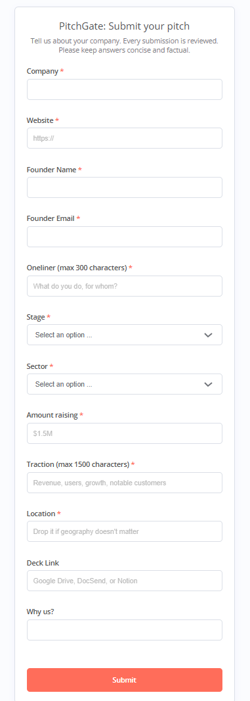
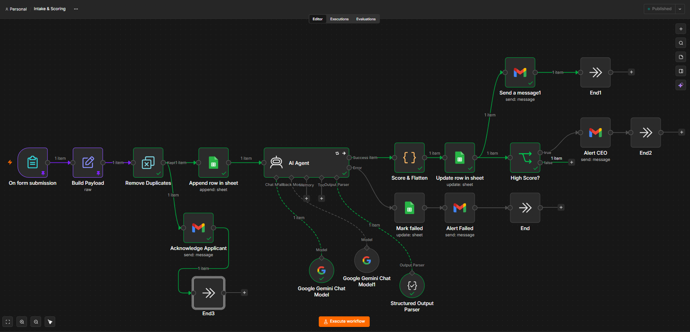
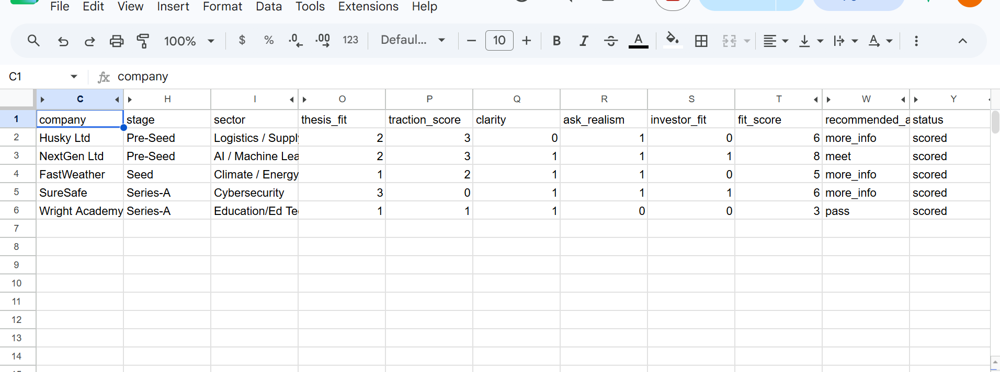
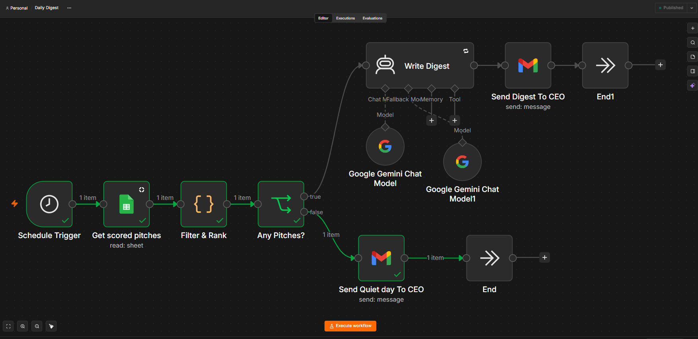
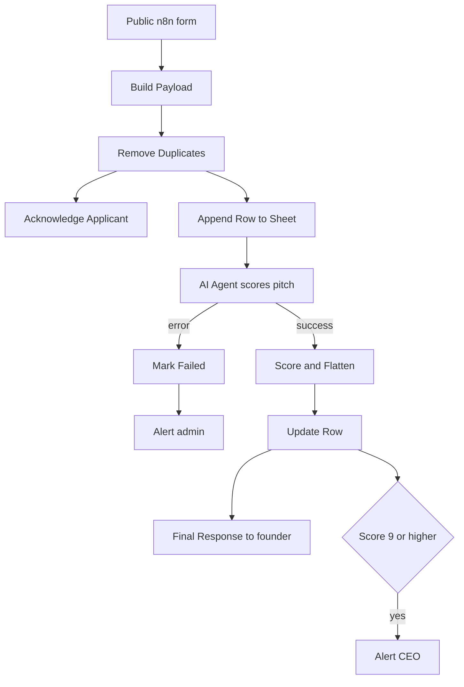
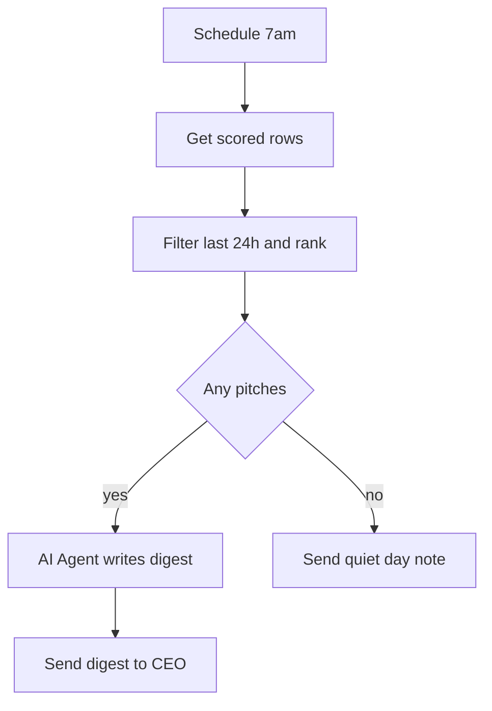

# **AI-assisted pitch screening for an early-stage investor, built with n8n, Google Gemini, Google Sheets, and Gmail.**

Founders submit a pitch through a public form. The system acknowledges them, scores the pitch against the investor's thesis, replies to the founder, alerts the CEO about exceptional pitches, and delivers a ranked morning digest of the best ones.

> **Status:** v1, single investor, tested on a small pilot. See [Results](#results) and [Limitations](#limitations).

---

## The problem

Investors receive far more pitches than they can read. Reading each one is slow, and replying to each one is slower. Founders, meanwhile, expect at least an acknowledgment, and most never get one.

This workflow was built to cut the triage workload without losing a good pitch or leaving founders in silence.

## What it does

1. **Acknowledges** the founder within seconds of submission
2. **Saves** the pitch to a Google Sheet, which doubles as the deal-flow database
3. **Scores** the pitch against the investor's thesis using an AI agent
4. **Replies** to the founder after scoring, using fixed templates
5. **Alerts** the CEO immediately for exceptional pitches (9+ out of 10)
6. **Digests** the day's best pitches (7+) into a ranked email at 7am

## Screenshots

### Founder submission form


### Intake and Scoring workflow (n8n)


### Scored submissions in the Sheet


*Sample data, hand-entered for illustration. Some columns are hidden for readability.*

### Daily Digest workflow (n8n)


## Architecture

### Workflow 1: Intake and Scoring



### Workflow 2: Daily Digest



### Workflow 3: Error Notifier

An Error Trigger workflow, linked to both workflows above, emails the admin when anything fails unexpectedly.

## How scoring works

Five criteria, 10 points total, each scored separately by the model:

| Criterion | Points | What it measures |
|---|---|---|
| Thesis fit | 3 | Stage, sector, and round size against the investor's thesis |
| Traction | 3 | Evidence of progress, judged relative to stage |
| Problem and customer clarity | 2 | Specific customer, specific pain, clear why-now |
| Ask realism | 1 | Whether the amount fits the stage and traction |
| Investor fit | 1 | Whether "Why us" shows real research |

Code, not the model, then adds the subscores and applies hard caps:

- Outside the thesis (thesis fit of 1 or less): **capped at 4**
- Any high-severity red flag: **capped at 4**
- Prompt-injection attempt detected: **score set to 0**

| Final score | Action |
|---|---|
| 8 to 10 | `meet` |
| 5 to 7 | `more_info` |
| 0 to 4 | `pass` |

Subscores are logged to the Sheet, so a reviewer can see why a pitch scored what it did.

## Design decisions

- **Persist before confirming.** The pitch is written to the Sheet in parallel with the acknowledgment, and any failure triggers an admin alert, so lost submissions are visible rather than silent.
- **Nothing is silently discarded.** A rejecting validation step was replaced with data cleanup (adding missing `https://`, trimming length), so every submission is saved and answered.
- **The AI never writes to founders.** Founders control the text the model reads, so an AI-drafted email could carry an injected instruction out under the firm's name. Founder emails use fixed templates chosen by score.
- **Layered prompt-injection defense.** The prompt treats submissions as untrusted data, the model flags injection attempts, and code forces the score to 0 when one is flagged.
- **Rules live in code, not the prompt.** Caps, ranges, and action thresholds don't depend on the model's judgment.
- **Duplicate protection.** An n8n Remove Duplicates step allows one submission per email address per clock hour, so repeated submissions can't trigger repeated emails or AI cost.
- **Structured output.** A Structured Output Parser removes fragile JSON handling, and a short code node validates ranges and flattens the result for Sheets.

## Reliability

- Primary and fallback Google Gemini models, plus retries
- Failed scoring is marked `failed` in the Sheet and triggers an admin alert
- A separate error workflow catches anything unexpected
- The digest sends a "quiet day" note when nothing qualifies, so silence never means "broken"

## Results

> **These are design targets, not measured results.** Replace the last column with real numbers from your pilot before publishing any performance claims.

| Metric | Design target | Measured |
|---|---|---|
| Acknowledgment to founder | Within about 5 seconds | |
| Submission to scored row | 15 to 40 seconds (about 1 minute if fallback is used) | |
| AI cost per pitch | About one cent or less (check current Gemini pricing) | |
| Scoring completed without manual intervention | 97 to 99% | |
| Agreement with CEO on advance vs. pass | 7 to 9 of 10 pitches | |
| Exact score within ±1 point | About 6 to 7 of 10 pitches | |
| Good pitches scored below 5 (false negatives) | 0 | |
| CEO screening time at about 50 pitches per week | About 5 hours down to under 1 hour | |

**Time-saving assumption:** manual triage at roughly 6 minutes per pitch (4 to screen, 2 to reply) is about 5 hours for 50 pitches. With this system, the CEO reads a 5-minute daily digest and spends about 5 minutes on each of the top 5 picks, roughly 50 minutes a week.

### How to measure

- **Latency:** subtract `submitted_at` from `processed_at` across test rows and report the median
- **Failure rate:** `failed` rows divided by total rows
- **Agreement:** have the CEO label past pitches advance or pass beforehand, then compare
- **False negatives:** check whether any pitch the CEO liked scored below 5. This is the most important number

With a small pilot, report counts ("8 of 10"), not accuracy percentages.

## Limitations

- v1 built for a single investor and tested on a small sample
- Scoring depends on founder-reported claims, which the system cannot verify
- Pitch decks are linked but not analyzed
- The thesis is hardcoded in the workflow
- Founder-market fit (team background) is not captured by the form

## Roadmap

- Deck analysis (extract text from linked or uploaded decks)
- Thesis stored in a Sheet so the CEO can edit it without touching the workflow
- Weekly summary of `more_info` pitches
- Team background field and a matching scoring criterion

## Tech stack

| Layer | Tool |
|---|---|
| Orchestration | n8n (self-hosted, Node.js) |
| Intake | n8n Form Trigger |
| AI | Google Gemini via the n8n AI Agent node (primary and fallback models), with Structured Output Parser |
| Storage | Google Sheets |
| Email | Gmail |

## Setup

1. Create a Google Sheet named `Founder Submissions` with these headers in row 1:

   ```
   submission_id, submitted_at, company, website, founder_name, founder_email, one_liner, stage, sector, amount, traction, location, deck_link, why_us, thesis_fit, traction_score, clarity, ask_realism, investor_fit, fit_score, fit_reason, red_flags, recommended_action, draft_reply, status, processed_at
   ```

2. In n8n, add credentials for Google Sheets, Gmail, and Google Gemini (PaLM) API.
3. Import the workflows from `/workflows` and reattach credentials to each node.
4. In `Build Payload`, replace the placeholder `thesis` with your investor's criteria.
5. Change the sender name and sign-off (`Investment Team`) in the two founder-facing emails if you want your own name, and set the recipient on the CEO nodes (`Alert CEO`, `Send Digest`, `Send Quiet Day`).
6. Set the Error Workflow on the intake and digest workflows to `Error Notifier`.
7. Publish all three workflows and share the **production** form URL.

Self-hosting notes: set `WEBHOOK_URL` to your public HTTPS address, run n8n under a process manager such as pm2 or systemd, and back up your workflows and `~/.n8n` folder.

## Repository structure

```
n8n-ai-pitch-screening/
├── README.md
├── workflows/
│   ├── intake-and-scoring.json
│   ├── daily-digest.json
│   └── error-notifier.json
└── docs/
    └── screenshots/
        ├── submission-form.png
        ├── intake-workflow.png
        ├── sheet-scored-rows.png
        └── daily-digest-workflow.png
```

## Security and privacy

- No credentials are stored in the exported workflows. Reattach your own after import.
- The public form collects founder names and emails. Handle them according to your privacy obligations and prune n8n execution data regularly.
- All sample data and screenshots in this repo are synthetic.
