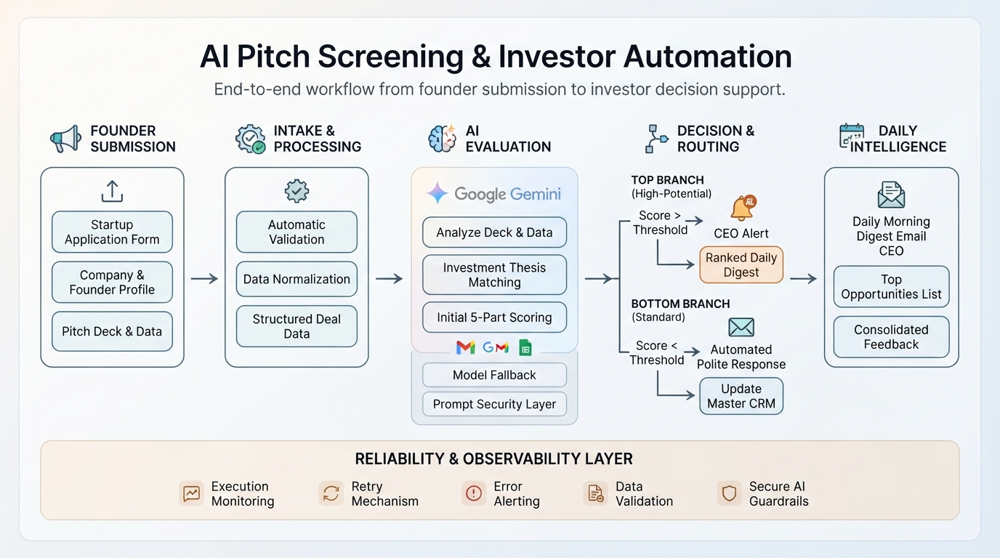
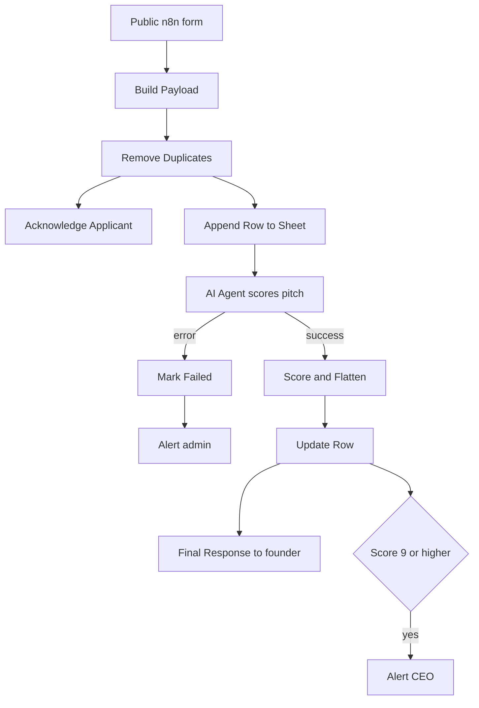
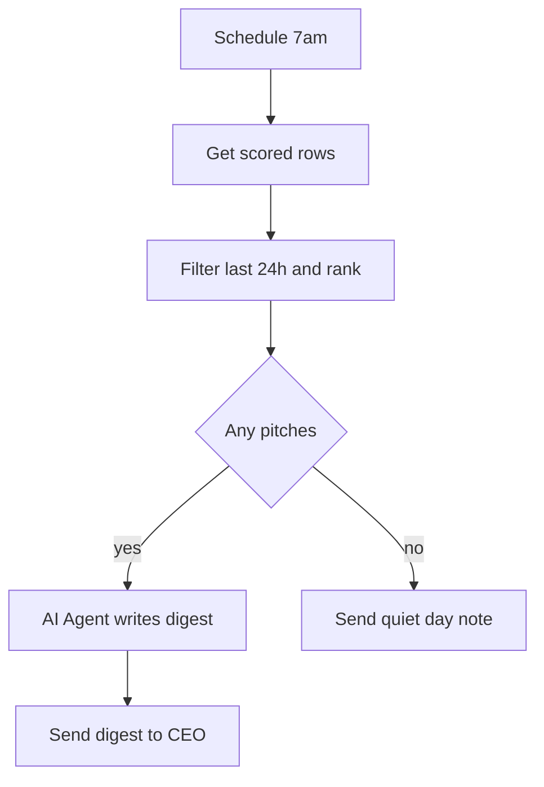

*AI-assisted pitch screening for an early-stage investor, built with n8n, Google Gemini, Google Sheets, and Gmail.*

Founders submit a pitch through a public form. The system acknowledges them, scores the pitch against the investor's thesis, replies to the founder, alerts the CEO about exceptional pitches, and delivers a ranked morning digest of the best ones.

> **Status:** v1, single investor, tested on a small pilot. See [Results](#results) and [Limitations](#limitations).

---

## The problem

Investors receive far more pitches than they can read. Reading each one is slow, and replying to each one is slower. Founders, meanwhile, expect at least an acknowledgment, and most never get one.

This architecture was built to cut the triage workload without losing a good pitch or leaving founders in silence.

## Architecture



The system combines three connected n8n workflows:

* **Intake & Scoring** — captures, validates, scores, and routes incoming pitches
* **Daily Digest** — ranks qualifying pitches and delivers a morning decision-support digest
* **Error Notifier** — provides cross-workflow failure detection and admin alerts

The architecture separates **AI evaluation from deterministic business rules**, while adding validation, fallback handling, persistence, routing, and monitoring.

## What it does

1. **Acknowledges** the founder within seconds of submission
2. **Saves** the pitch to a Google Sheet, which doubles as the deal-flow database
3. **Scores** the pitch against the investor's thesis using an AI agent
4. **Replies** to the founder after scoring, using fixed templates
5. **Alerts** the CEO immediately for exceptional pitches (9+ out of 10)
6. **Digests** the day's best pitches (7+) into a ranked email at 7am

## Screenshots

### Founder submission form


### Intake and Scoring workflow (n8n)


### Scored submissions in the Sheet


*Sample data, hand-entered for illustration. Some columns are hidden for readability.*

### Daily Digest workflow (n8n)


### Workflow 1: Intake and Scoring



### Workflow 2: Daily Digest



### Workflow 3: Error Notifier

An Error Trigger workflow, linked to both workflows above, emails the admin when anything fails unexpectedly.

## Repository structure

```text
n8n-ai-pitch-screening/
├── README.md
├── workflows/
│   ├── intake-and-scoring.json
│   ├── daily-digest.json
│   └── error-notifier.json
└── docs/
    ├── architecture/
    │   └── ai-pitch-screening-architecture.png
    └── screenshots/
        ├── submission-form.png
        ├── intake-workflow.png
        ├── sheet-scored-rows.png
        └── daily-digest-workflow.png
```
